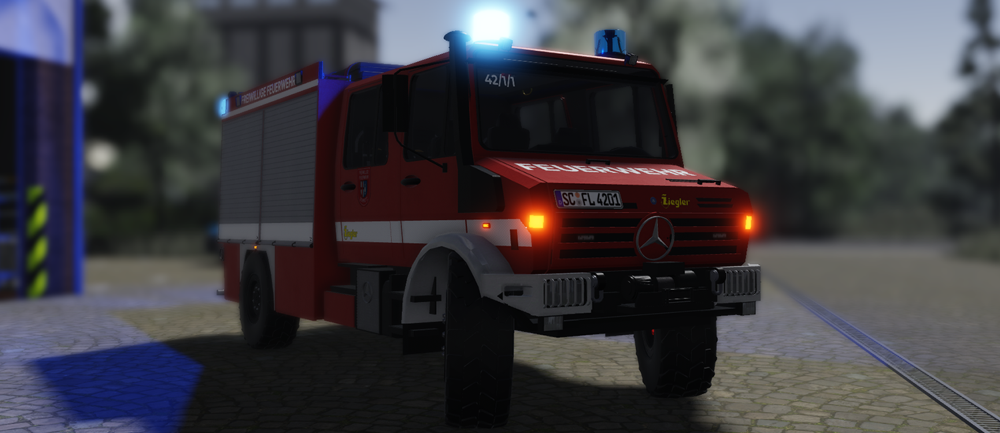
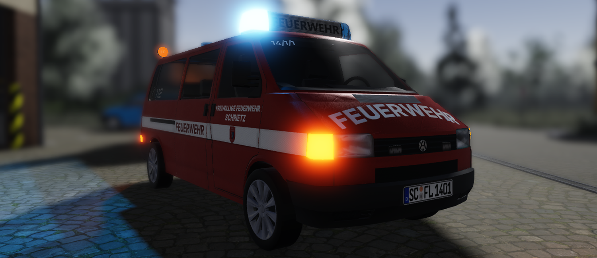
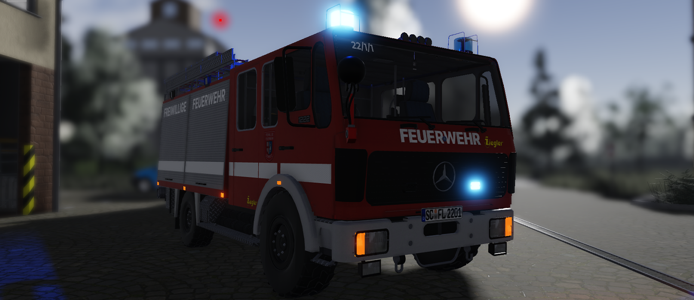
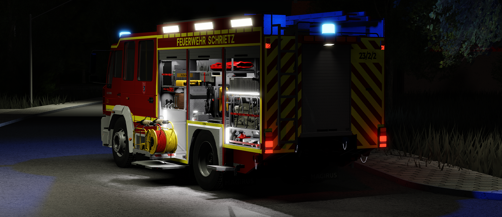
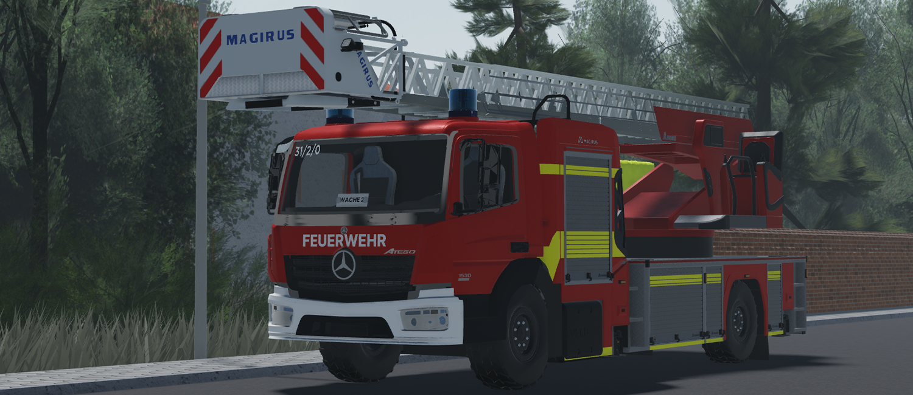
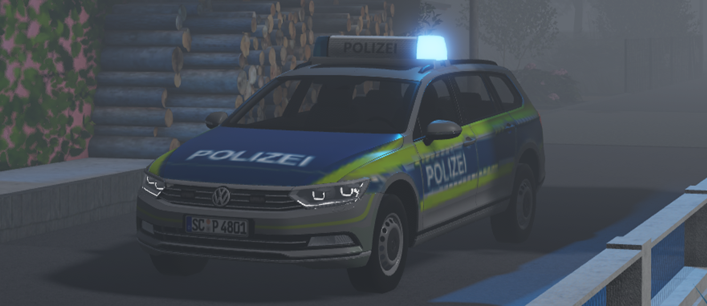

# Fahrzeugvorstellung
---
## Wache 1
### Hilfeleistungslöschfahrzeug

- Verfügbar ab Rang: 0
- Kapazität: 9 Spieler

**Fahrzeugspezifikationen:**
- Ausbau: Ziegler
- Besatzung: [Staffel/Gruppe]

**Funktionen:**
- Wassertank
- Schlauchsystem
- Rettungsausrüstung
- Lichtmast

### Mannschaftstransportwagen

- Verfügbar ab Rang: 2
- Kapazität: 6 Spieler

**Fahrzeugspezifikationen:**
- Ausbau: Eigenbau
- Besatzung: [Staffel/Gruppe]

**Funktionen:**
- Sitztplätze (Transport von Spielern)

### Tanklöschfahrzeug

- Verfügbar ab Rang: 3
- Kapazität: 8 Spieler

**Fahrzeugspezifikationen:**
- Ausbau: Ziegler
- Besatzung: [Staffel/Gruppe]

**Funktionen:**
- Wassertank
- Schlauchsystem
- Rettungsausrüstung

## Wache 2
### Hilfeleistungslöschfahrzeug

- Verfügbar ab Rang: 0
- Kapazität: 9 Spieler

**Fahrzeugspezifikationen:**
- Ausbau: Ziegler
- Besatzung: [Staffel/Gruppe]

**Funktionen:**
- Wassertank
- Schlauchsystem
- Rettungsausrüstung

### Drehleiter mit Rettungskorb

- Verfügbar ab Rang: 10
- Kapazität: 2 Spieler

**Fahrzeugspezifikationen:**
- Ausbau: Magirus
- Besatzung: [Staffel]

**Funktionen:**
- Leiter mit Rettungskorb
- Lüfter

## Rettungswache

## Polizeiwache
### Streifenwagen

- Verfügbar mit [Polizei-Gamepass](https://www.roblox.com/game-pass/50320427/RP-Polizei-Gamepass)
- Kapazität: 4 Spieler

**Fahrzeugspezifikationen:**
- Ausbau: Eigenbau
- Besatzung: [Streife]

**Funktionen:**
- test