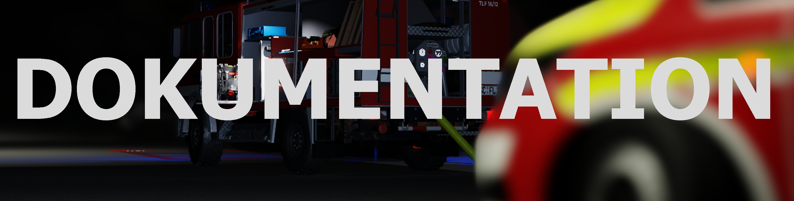

# Willkommen zur [Feuerwehr Schrietz](https://www.roblox.com/games/8238839739/Feuerwehr-Schrietz) Dokumentation!
---

## Einführung

Egal, ob du ein neuer Spieler bist oder ein erfahrener Spieler, hier findest du alles, was du brauchst, um das Beste aus dem Gameplay herauszuholen!

---
## Grundlagen des Spiels

Es dreht sich um die Simulation von Feuerwehr, Rettungsdienst und Polizei Einsätzen. Der Spieler kann an verschiedenen Bränden, Unfällen und Notfällen teilnehmen.

Grundlegendene Features des Spiels:

- **Einsätze**: Brände löschen, technische Rettungen und medizinische Notfälle
- **Feuerwachen und Fahrzeuge**: Zwei Feuerwachen, verschiedene Feuerwehrfahrzeuge und Aufgaben
- **Realismus**: Realistisches Schlauchsystem, detaillierte Feuerwehrfahrzeuge, Große Karte
- **Level- und Rangsystem**: Großes Rangsystem zur Freischaltung der Fahrzeuge und Teams

!!!warning Hinweis
Spiel befindet sich noch in der Entwicklung, Bugs können auftreten. Wir sind uns der Probleme bewusst, die das Spiel derzeit hat, dafür gibt es regelmäßige Updates und Fixes!
!!!